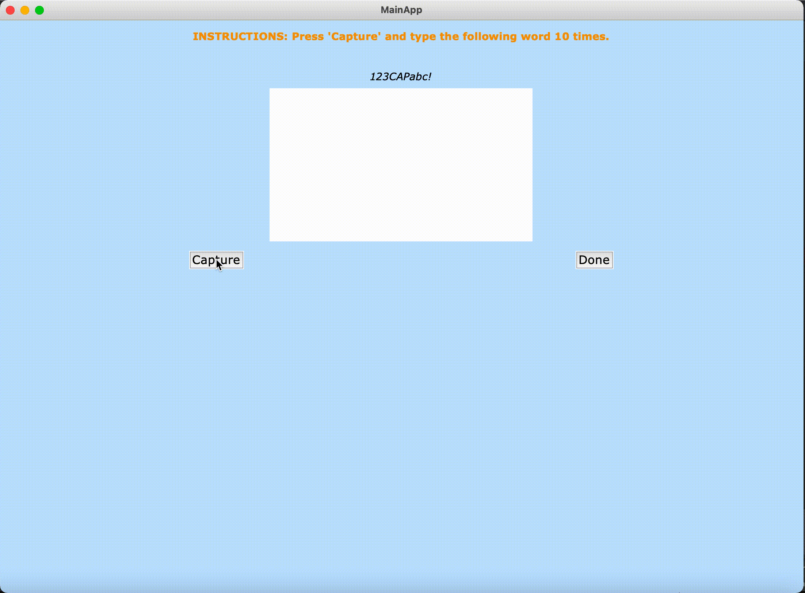

# Bot Detection

___

|   |   |
|---|---|
 | 

This program, developed with Rehnuma Tabassum, was part of our capstone project 'Detecting IMAP
Credential Stuffing Bots Using Behavioural Biometrics' as part of our requirement for the Master of Applied 
Cybersecurity at the University of New Brunswick. The goal of this project was to mitigate credential stuffing attacks
against the IMAP protocol, which has become a [significant](https://www.bleepingcomputer.com/news/security/multi-factor-auth-bypassed-in-office-365-and-g-suite-imap-attacks/) 
[problem](https://www.cayosoft.com/massive-attacks-bypass-mfa-on-office-365-and-g-suite-accounts-via-imap-protocol/) in recent years. For companies
that still require legacy protocols like IMAP, which do not support multi-factor authentication (MFA), for their email portals, disabling IMAP is not 
an option, so alternative solutions are required. 

As most credential stuffing attacks are carried out by bots, we proposed a supervised learning system that detects credential stuffing 
bots using two kinds of behavioural biometrics: mouse and keystroke dynamics. The system records a user’s mouse and keystroke events while 
they complete three tasks in a graphical user interface (GUI) application. To test our system, we developed two types of bots: 
a simple bot which makes no attempt to appear human, and an advanced bot that uses techniques to simulate human-like mouse and keyboard motions. 
We evaluated our system using the Random Forest (RF), Decision Tree (DT), Support Vector Machine (SVM), and K-Nearest Neighbors (KNN) 
algorithms and compared them against two data sets: one containing human and simple bot data, and one containing human and advanced 
bot data. We evaluated our system with 5-fold cross validation and achieved accuracies of roughly 96% for both data sets.

## Overview 

___

There are multiple modules in the program:
* `app` is the GUI with the three tasks to complete, namely:
  * Typing a specified word 10 times
  * Clicking a moving ball 10 times
  * Sorting 8 fruits and animals into boxes
* `bot` contains two bot scripts that are meant to be run simultaneously with the GUI program to complete the tasks automatically
* `feature_extraction` calculates the various mouse and keystroke features from the user's mouse and keystroke data
* `classification` creates the feature data sets, implements the learning algorithms, and runs the cross validation to calculate four scores:
  * Precision
  * Recall
  * Accuracy
  * F-score
* `util` contains helper functions

## Dependencies 

___

* Pillow 
* PyAutoGUI
* Matplotlib 
* NumPy 
* OpenCV 
* Pandas 
* pynput 
* Scikit-learn
* SciPy 

## How to Use

___

### Running the app
To run the app without the bots:
```shell
python3 app/app.py human 
```
To run the app with the simple bot, open two terminal windows or tabs:
```shell
# Run this in the first window/tab
python3 app/app.py simple
# Run this in the second window/tab
python3 bot/simple_bot.py
```
Similarly, to run the app with the advanced bot:
```shell
# Run this in the first window/tab
python3 app/app.py advanced
# Run this in the second window/tab
python3 bot/advanced_bot.py
```

The mouse and keystroke data are saved under **data/events/**.

### Running the Feature Extraction
```shell
python3 feature_extraction/extract_features.py
```

The mouse and keystroke features are saved under **data/features***.

### Running the cross validation
```shell
python3 classification/classification.py
```